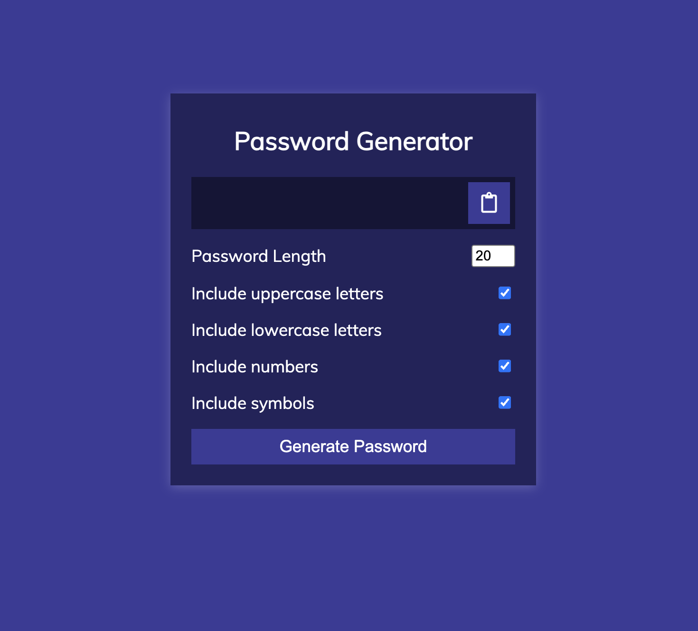

# 🔐 Password Generator

A clean, fast, and responsive **Password Generator** built using **HTML, CSS, and JavaScript**. It allows users to generate strong, customizable passwords with options for length, uppercase, lowercase, numbers, and symbols.

🌐 **Live Demo:** [Click here to try it out](passwordgenerator13.netlify.app)

---

## 🚀 Features

- ✅ Generate secure random passwords
- 🔢 Choose desired password length
- 🔡 Include/exclude:
  - Uppercase letters
  - Lowercase letters
  - Numbers
  - Symbols
- 📋 One-click copy to clipboard
- 🎨 Clean and responsive UI
- ⚡ Instant result updates

---

## 📸 Preview




---

## 🛠️ Built With

- HTML5
- CSS3
- JavaScript (Vanilla)

---

## 📁 Folder Structure

password_generator/
├── index.html
├── style.css
├── script.js
├── README.md

## 🧑‍💻 Getting Started (Local Setup)

1. Clone the repository:
   ```bash
   git clone git@github.com:1-am-Abhi/password_generator.git
   cd password_generator
Open index.html in your browser:
open index.html
No build tools or installations needed!

🤝 Contributions
Contributions, issues, and feature requests are welcome!
Feel free to fork the repo and open a pull request.

🙋‍♂️ Author
Abhijeet Kumar
Email: kumarabhijeet1304@gmail.com

[GitHub](https://github.com/1-am-Abhi)

⭐️ Show Your Support
If you like this project, don’t forget to ⭐️ the repository and share it!
